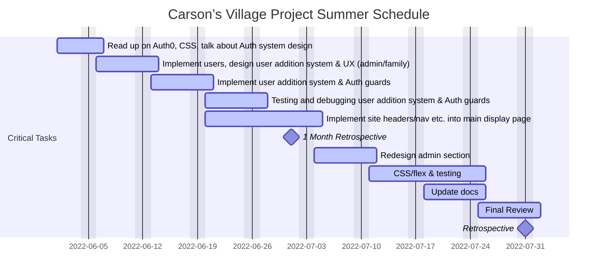

# Design Document - Summer 2022
#### Alexis Jennings, Evelyn Kha
****
## Summary
The objective of this summer project is to expedite the progress of the Carson’s Village Automated Family Pages project for deployment in the fall semester. We will be working on the following tasks:
1. Completion of authentication features that will secure the login for family members as well as Carson’s Village admins.
2. Completion of User Interface (UI/UX) enhancements for the current project, also known as the front-end.
## Duration
The project’s duration will be two months. The first month will be focused on implementing authentication, and the second month will be focused on completing the front-end of the project.
## Timeline

## Mock-Ups/Requirements
### Authentication
Authentication design will integrate auth0, an authorization tool that centralizes authentication and identity management, into the current codebase. 
- Will be a secure process because auth0 will keep track of the passwords without us having to store it in our database

Auth0 will also include a single sign on (SSO) feature that will validate the user using a supported third-party. 
- For example, admins from carsonsvillage.org can login and family clients can use their gmail account. 

### User Interface Upgrade
- Implementing a user-friendly design for the page creation feature we created
- Website theme will match the Carson’s Village official website style